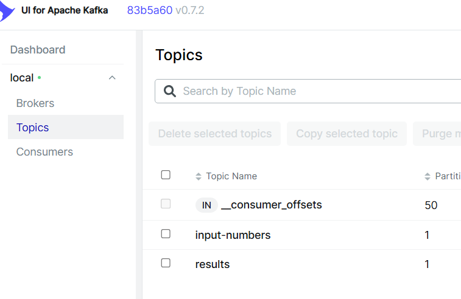

# Kafka Calculator - Инструкция по запуску

## Описание проекта

Прототип системы для выполнения математических операций с использованием Apache Kafka. Система обеспечивает атомарность операций через транзакции и надёжное хранение данных.

**Поддерживаемые операции:**
- `sq` - возведение в квадрат
- `abs` - абсолютное значение числа

## Предварительные требования

- Docker Desktop (для Windows)
- Java JDK 21
- Maven или Gradle для сборки проекта

## Шаг 1: Настройка Kafka кластера

### Создайте docker-compose.yml

```yaml
services:
  kafka:
    image: apache/kafka:4.0.0
    container_name: calc-kafka
    ports:
      - '9092:9092'  # Порт для Java-приложений
    networks:
      - kafka-network
    environment:
      # Уникальный ID ноды
      KAFKA_NODE_ID: 1
      KAFKA_PROCESS_ROLES: broker,controller
      
      # Три listener'а для разных типов соединений
      KAFKA_LISTENERS: PLAINTEXT://0.0.0.0:19092,CONTROLLER://0.0.0.0:9093,EXTERNAL://0.0.0.0:9092
      
      # Адреса для клиентов
      KAFKA_ADVERTISED_LISTENERS: PLAINTEXT://kafka:19092,EXTERNAL://localhost:9092
      
      # Протоколы безопасности
      KAFKA_LISTENER_SECURITY_PROTOCOL_MAP: CONTROLLER:PLAINTEXT,EXTERNAL:PLAINTEXT,PLAINTEXT:PLAINTEXT
      KAFKA_CONTROLLER_LISTENER_NAMES: CONTROLLER
      
      # Кворум контроллеров (1 нода)
      KAFKA_CONTROLLER_QUORUM_VOTERS: 1@kafka:9093
      
      # Replication factor = 1 (одна нода)
      KAFKA_OFFSETS_TOPIC_REPLICATION_FACTOR: 1
      KAFKA_TRANSACTION_STATE_LOG_REPLICATION_FACTOR: 1
      KAFKA_TRANSACTION_STATE_LOG_MIN_ISR: 1
      
      # Директория для данных
      KAFKA_LOG_DIRS: /tmp/kraft-logs
      
      # Cluster ID для KRaft режима
      CLUSTER_ID: MkU3OEVBNTcwNTJENDM2Qk
      
    restart: unless-stopped

  kafka-ui:
    image: provectuslabs/kafka-ui:latest
    container_name: calc-kafka-ui
    ports:
      - '7080:8080'  # Веб-интерфейс на http://localhost:7080
    networks:
      - kafka-network
    environment:
      KAFKA_CLUSTERS_0_NAME: local
      KAFKA_CLUSTERS_0_BOOTSTRAPSERVERS: kafka:19092
      DYNAMIC_CONFIG_ENABLED: 'true'
    depends_on:
      - kafka
    restart: unless-stopped

networks:
  kafka-network:
    driver: bridge
```

### Запустите кластер

```bash
# Запуск контейнеров
docker-compose up -d

# Проверка статуса
docker-compose ps

# Просмотр логов Kafka (должна появиться строка: [KafkaServer id=1] started)
docker logs calc-kafka --tail 50
```

**Ожидаемый вывод docker-compose ps:**
```
NAME            STATUS
calc-kafka      Up
calc-kafka-ui   Up
```

## Шаг 2: Создание топиков

```bash
# Создать топик для входных чисел (10 партиций, replication factor = 1)
docker exec -it calc-kafka kafka-topics --create \
  --topic input-numbers \
  --partitions 10 \
  --replication-factor 1 \
  --bootstrap-server localhost:9092

# Создать топик для результатов (10 партиций, replication factor = 1)
docker exec -it calc-kafka kafka-topics --create \
  --topic results \
  --partitions 10 \
  --replication-factor 1 \
  --bootstrap-server localhost:9092


# Проверить созданные топики
docker exec -it calc-kafka kafka-topics --list \
  --bootstrap-server localhost:9092
```
# Проверить созданные топики в kafka-ui

**Ожидаемый вывод:**
```
input-numbers
results
```

### Проверка конфигурации топика

```bash
docker exec -it calc-kafka kafka-topics --describe \
  --topic input-numbers \
  --bootstrap-server localhost:9092
```

**Ожидаемый вывод:**
```
Topic: input-numbers    TopicId: ...    PartitionCount: 10      ReplicationFactor: 1
    Topic: input-numbers    Partition: 0    Leader: 1       Replicas: 1     Isr: 1
    Topic: input-numbers    Partition: 1    Leader: 1       Replicas: 1     Isr: 1
    ...
```

## Шаг 3: Просмотр кластера в Kafka UI

Откройте браузер и перейдите по адресу: **http://localhost:7080**

### Что вы увидите:

- **Dashboard**: Общая статистика кластера
- **Brokers**: 1 брокер (ID: 1), статус: Active
- **Topics**:
    - `input-numbers` (10 партиций)
    - `results` (10 партиций)
- **Consumers**: Пока пусто (появятся после запуска Consumer)

### Возможности Kafka UI:

1. **Просмотр сообщений** в реальном времени
2. **Отправка сообщений** вручную через UI
3. **Мониторинг Consumer Groups** и их offset'ов
4. **Создание/удаление топиков** через веб-интерфейс
5. **Просмотр конфигурации** брокеров и топиков

## Шаг 4: Конфигурация Java-приложений

### Producer (CalculatorProducer.java)

```java
Properties props = new Properties();
props.put("bootstrap.servers", "localhost:9092");
props.put("transactional.id", "calculator-producer-id");
props.put("transaction.timeout.ms", "300000");
props.put("key.serializer", "org.apache.kafka.common.serialization.StringSerializer");
props.put("value.serializer", "org.apache.kafka.common.serialization.StringSerializer");
```

### Consumer (CalculationConsumer.java)

```java
Properties props = new Properties();
props.setProperty("bootstrap.servers", "localhost:9092");
props.setProperty("group.id", "calc-consumer");
props.setProperty("key.deserializer", "org.apache.kafka.common.serialization.StringDeserializer");
props.setProperty("value.deserializer", "org.apache.kafka.common.serialization.StringDeserializer");
props.setProperty("isolation.level", "read_committed");
props.setProperty("auto.offset.reset", "earliest");  // Начинать с начала топика
```

## Шаг 5: Запуск приложений

### Запуск Consumer (Терминал 1)

```bash
java org.drm.kafka.calculator.CalculationConsumer
```

Consumer начнет читать сообщения из топиков `input-numbers` и `results`.

### Запуск Producer (Терминал 2)

```bash
java org.drm.kafka.calculator.CalculatorProducer
```

**Вывод:**
```
Вас приветствует самый умный Kafka-калькулятор
Введите исходное значение:
```

## Шаг 6: Тестирование системы

### Тест 1: Возведение в квадрат

**Ввод в Producer:**
```
Введите исходное значение:
5
Введите операцию и нажмите enter:
sq
```

**Вывод в Consumer:**
```
5
5 sq 25
```

**В Kafka UI** (Topics → input-numbers):
```json
Key: "5"
Value: "5"
Partition: 5
```

**В Kafka UI** (Topics → results):
```json
Key: "5"
Value: "5 sq 25"
Partition: 5
```

### Тест 2: Абсолютное значение

**Ввод в Producer:**
```
Введите исходное значение:
-10
Введите операцию и нажмите enter:
abs
```

**Вывод в Consumer:**
```
-10
-10 abs 10
```

### Тест 3: Невалидная операция (проверка rollback)

**Ввод в Producer:**
```
Введите исходное значение:
7
Введите операцию и нажмите enter:
invalid
```

**Вывод в Producer:**
```
Ошибка: Невалидная операция
```

**Результат:** В Kafka UI **не появятся** ни входное число (7), ни результат — транзакция была откатана (abort).

## Архитектура решения

### Компоненты системы

1. **Kafka Broker**: Хранит сообщения в топиках
2. **Producer**: Принимает пользовательский ввод, выполняет операции, отправляет результаты
3. **Consumer**: Читает и отображает сообщения из обоих топиков
4. **Kafka UI**: Веб-интерфейс для мониторинга

### Топики

| Топик | Назначение | Формат сообщений |
|-------|-----------|------------------|
| `input-numbers` | Хранит все входные числа (история запросов) | Значение: `"5"` |
| `results` | Хранит результаты вычислений | Значение: `"5 sq 25"` |

### Ключ партиции

**Логика:** `inputNumber % 10`

**Преимущества:**
- Равномерное распределение по 10 партициям
- Все операции с одним числом попадают в одну партицию
- Сохраняется порядок сообщений внутри партиции

**Пример:**
- Число `5` → партиция 5
- Число `17` → партиция 7
- Число `-10` → партиция 0

### Транзакции

Producer использует транзакции для обеспечения **атомарности**:

```
BEGIN TRANSACTION
  1. Отправить число в топик input-numbers
  2. Вычислить результат
  3. Отправить результат в топик results
COMMIT TRANSACTION
```

**Если операция успешна:**
- Оба сообщения записываются
- Consumer видит оба сообщения

**Если произошла ошибка:**
- `abortTransaction()` откатывает изменения
- Ни одно сообщение не появляется в топиках
- Consumer не видит незавершенные транзакции

### Изоляция Consumer

```java
props.setProperty("isolation.level", "read_committed");
```

**Гарантия:** Consumer читает **только зафиксированные** (committed) сообщения и не видит данные из откатанных транзакций.

## Мониторинг через Kafka UI

### 1. Просмотр сообщений

**Topics → input-numbers → Messages**

Вы увидите все входные числа:
```
Partition 0: -10
Partition 5: 5, 15, 25
Partition 7: 7, 17
...
```

### 2. Мониторинг Consumer Group

**Consumers → calc-consumer**

Информация:
- **State**: Stable
- **Members**: 1
- **Lag**: 0 (если Consumer обработал все сообщения)
- **Offsets по партициям**: Показывает текущую позицию чтения

### 3. Проверка Lag (задержки)

**Consumer Lag = (Last Offset) - (Current Offset)**

Если Lag > 0 — Consumer не успевает обрабатывать сообщения.

### 4. Отправка тестового сообщения

1. Topics → `input-numbers` → **Produce Message**
2. Key: `3`
3. Value: `3`
4. **Send**

Consumer сразу отобразит это сообщение.

## Полезные команды

### Управление топиками

```bash
# Список всех топиков
docker exec -it calc-kafka kafka-topics --list --bootstrap-server localhost:9092

# Описание топика
docker exec -it calc-kafka kafka-topics --describe --topic input-numbers --bootstrap-server localhost:9092

# Удаление топика
docker exec -it calc-kafka kafka-topics --delete --topic input-numbers --bootstrap-server localhost:9092
```

### Чтение сообщений

```bash
# Чтение всех сообщений из топика results (с начала)
docker exec -it calc-kafka kafka-console-consumer \
  --topic results \
  --from-beginning \
  --bootstrap-server localhost:9092

# Чтение только новых сообщений
docker exec -it calc-kafka kafka-console-consumer \
  --topic results \
  --bootstrap-server localhost:9092
```

### Мониторинг Consumer Groups

```bash
# Список всех consumer groups
docker exec -it calc-kafka kafka-consumer-groups --list --bootstrap-server localhost:9092

# Описание consumer group
docker exec -it calc-kafka kafka-consumer-groups \
  --describe \
  --group calc-consumer \
  --bootstrap-server localhost:9092
```

**Вывод:**
```
GROUP           TOPIC           PARTITION  CURRENT-OFFSET  LOG-END-OFFSET  LAG
calc-consumer   input-numbers   0          5               5               0
calc-consumer   input-numbers   1          3               3               0
...
calc-consumer   results         0          5               5               0
...
```

### Сброс offset'ов

```bash
# Сбросить offset на начало (для повторной обработки)
docker exec -it calc-kafka kafka-consumer-groups \
  --bootstrap-server localhost:9092 \
  --group calc-consumer \
  --topic input-numbers \
  --reset-offsets \
  --to-earliest \
  --execute
```

## Troubleshooting

### Проблема: Kafka не стартует

**Симптомы:**
- Контейнер постоянно перезапускается
- `docker-compose ps` показывает статус `Restarting`

**Решение:**
```bash
# Проверьте логи на ошибки
docker logs calc-kafka

# Типичные проблемы:
# 1. Порт 9092 занят другим процессом
netstat -ano | findstr "9092"

# 2. Недостаточно памяти для Docker Desktop
# Выделите минимум 4GB RAM в настройках Docker Desktop

# 3. Пересоздайте контейнеры с чистыми volumes
docker-compose down -v
docker-compose up -d
```

### Проблема: Consumer не получает сообщения

**Симптомы:**
- Producer отправляет сообщения
- Consumer не выводит ничего в консоль

**Решение:**

1. **Проверьте порядок запуска:**
```bash
# 1. Сначала создайте топики
# 2. Запустите Consumer
# 3. Запустите Producer
```

2. **Проверьте подключение:**
```java
// В обоих приложениях должно быть:
props.setProperty("bootstrap.servers", "localhost:9092");
```

3. **Проверьте изоляцию:**
```java
// Consumer должен иметь:
props.setProperty("isolation.level", "read_committed");
```

4. **Проверьте Consumer Group:**
```bash
docker exec -it calc-kafka kafka-consumer-groups \
  --describe \
  --group calc-consumer \
  --bootstrap-server localhost:9092
```

Если LAG > 0 — сообщения есть, но Consumer их не обработал.

### Проблема: Kafka UI не открывается

**Симптомы:**
- http://localhost:7080 не загружается
- Ошибка "This site can't be reached"

**Решение:**

1. **Проверьте статус контейнера:**
```bash
docker logs calc-kafka-ui

# Ищите строку:
# Started Application in X seconds
```

2. **Проверьте порт:**
```bash
netstat -ano | findstr "7080"

# Если порт занят, измените в docker-compose.yml:
ports:
  - '8082:8080'  # Используйте другой внешний порт
```

3. **Проверьте подключение к Kafka:**
```yaml
# В docker-compose.yml должно быть:
KAFKA_CLUSTERS_0_BOOTSTRAPSERVERS: kafka:19092  # Через имя контейнера
```

### Проблема: Транзакции не работают

**Симптомы:**
- Consumer видит сообщения из откатанных транзакций
- При ошибке оба топика содержат сообщения

**Решение:**

1. **Producer должен использовать транзакции:**
```java
producer.initTransactions();
producer.beginTransaction();
// ... send messages
producer.commitTransaction();
// или
producer.abortTransaction();
```

2. **Consumer должен читать committed:**
```java
props.setProperty("isolation.level", "read_committed");
```

3. **Проверьте конфигурацию Kafka:**
```yaml
KAFKA_TRANSACTION_STATE_LOG_REPLICATION_FACTOR: 1
KAFKA_TRANSACTION_STATE_LOG_MIN_ISR: 1
```

### Проблема: DEBUG логи засоряют консоль

**Решение:** Создайте `src/main/resources/logback.xml`:

```xml
<configuration>
    <appender name="CONSOLE" class="ch.qos.logback.core.ConsoleAppender">
        <encoder>
            <pattern>%d{HH:mm:ss.SSS} %-5level %logger{36} - %msg%n</pattern>
        </encoder>
    </appender>

    <!-- Отключаем DEBUG-логи от Kafka -->
    <logger name="org.apache.kafka" level="WARN"/>
    
    <root level="INFO">
        <appender-ref ref="CONSOLE"/>
    </root>
</configuration>
```

## Остановка и очистка

### Остановка контейнеров (с сохранением данных)

```bash
docker-compose down
```

Данные в топиках сохранятся в Docker volumes.

### Полная очистка (удаление всех данных)

```bash
# Остановить и удалить volumes
docker-compose down -v

# Проверить, что volumes удалены
docker volume ls | findstr kafka
```

**Внимание:** Все сообщения в топиках будут удалены!

## Дополнительные сценарии

### Сценарий 1: Массовая загрузка данных

Отправьте несколько операций подряд:

```
5 → sq → 25
10 → abs → 10
-3 → abs → 3
7 → sq → 49
```

В Kafka UI увидите все сообщения распределенные по партициям.

### Сценарий 2: Проверка порядка сообщений

Отправьте несколько сообщений с одним ключом:

```
5 → sq → 25
15 → sq → 225
25 → sq → 625
```

Все три попадут в **партицию 5** и будут обработаны в том же порядке.

### Сценарий 3: Остановка Consumer

1. Остановите Consumer (Ctrl+C)
2. Отправьте несколько сообщений через Producer
3. В Kafka UI увидите, что LAG растет
4. Запустите Consumer снова — он обработает все накопленные сообщения

### Сценарий 4: Повторная обработка

```bash
# Сбросить offset'ы на начало
docker exec -it calc-kafka kafka-consumer-groups \
  --bootstrap-server localhost:9092 \
  --group calc-consumer \
  --all-topics \
  --reset-offsets \
  --to-earliest \
  --execute

# Запустите Consumer — он заново обработает все сообщения
```

## Заключение

Теперь у вас работает полнофункциональная система:

✅ **Kafka кластер** с одним брокером в KRaft режиме  
✅ **Транзакционный Producer** с exactly-once семантикой  
✅ **Consumer** с read_committed изоляцией  
✅ **Kafka UI** для визуализации и мониторинга  
✅ **Атомарные операции** записи в два топика  
✅ **Партиционирование** для масштабируемости

Вы научились:
- Настраивать Kafka в Docker
- Работать с транзакциями
- Использовать Kafka UI для мониторинга
- Обрабатывать ошибки и откатывать транзакции
- Проверять offset'ы и lag Consumer Groups

**Следующие шаги:**
- Изучите Kafka Streams для потоковой обработки
- Добавьте больше операций в калькулятор
- Экспериментируйте с несколькими Consumer'ами в одной группе
- Попробуйте конфигурацию с 2-3 брокерами для изучения репликации